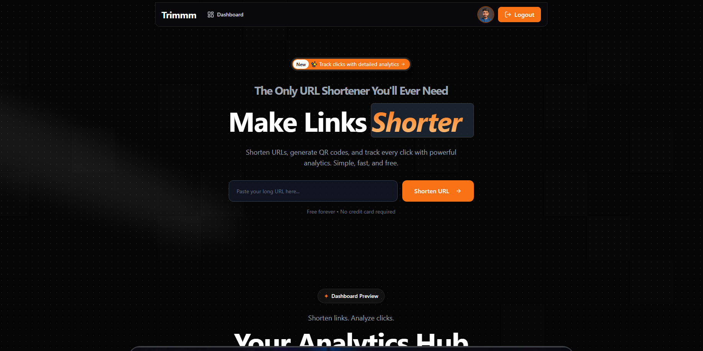

# Trimmm - The Modern URL Shortener ✂️



Trimmm is a sophisticated, open-source URL shortening service designed for speed, reliability, and detailed analytics. Built with a modern tech stack, it provides users with powerful tools to manage their links effectively while offering a sleek, responsive user experience.

## ✨ Key Features

### 🔗 Link Management
-   **Smart Shortening**: Instantly convert long, unwieldy URLs into clean, manageable short links.
-   **Custom Back-halves**: Create branded links with custom aliases (e.g., `trimmm.com/your-brand`).
-   **Bulk Management**: Efficiently manage your library of links from a centralized dashboard.
-   **QR Code Generation**: Automatically generate and download high-resolution QR codes for every link.
-   **Exportable Data**: Download QR codes and meaningful data distributions for offline use.

### 📊 Advanced Analytics
-   **Real-time Click Tracking**: Monitor link performance as it happens.
-   **Geographic Insights**: detailed breakdown of clicks by city and country using interactive charts.
-   **Device Analytics**: Understand your audience with stats on device types (Mobile vs. Desktop).
-   **Visual Data**: Beautiful, interactive charts powered by Recharts for easy data consumption.

### 🔐 Security & User Experience
-   **Secure Authentication**: Robust signup and login system integrated with Supabase.
-   **Email Verification**: Verify user identities to prevent spam and abuse.
-   **Responsive Design**: A fully responsive interface that works flawlessly across Mobile, Tablet, and Desktop.
-   **Dark Mode UI**: A premium, eye-friendly dark interface built with Tailwind CSS.

## 🛠️ Technical Architecture

Trimmm is built using a modern, scalable architecture:

-   **Frontend Framework**: [React](https://reactjs.org/) + [Vite](https://vitejs.dev/) for lightning-fast development and build performance.
-   **Styling Engine**: [Tailwind CSS](https://tailwindcss.com/) for utility-first styling, combined with [Shadcn UI](https://ui.shadcn.com/) and [Aceternity UI](https://ui.aceternity.com/) for premium, accessible components.
-   **State Management**: React Context API for efficient global state handling (User, Auth, Links).
-   **Animations**: [Framer Motion](https://www.framer.com/motion/) for smooth, production-ready animations (staggered entrances, scroll triggers).
-   **Routing**: [React Router v6](https://reactrouter.com/) for seamless client-side navigation.
-   **Data Visualization**: [Recharts](https://recharts.org/) for composable and reliable charting.
-   **Form Handling**: [Yup](https://github.com/jquense/yup) for schema validation.
-   **Backend Integration**: Integrated with a custom backend (Node.js/Express) and Supabase for database/auth.

## � Getting Started

Follow these steps to set up the project locally.

### Prerequisites
-   Node.js (v18 or higher)
-   npm or yarn

### Installation

1.  **Clone the Repository**
    ```bash
    git clone https://github.com/izahid19/url_shortner.git
    cd url_shortner/Frontend
    ```

2.  **Install Dependencies**
    ```bash
    npm install
    ```

3.  **Environment Configuration**
    Create a `.env` file in the root directory and add your backend API URL and Supabase credentials.
    ```env
    VITE_BACKEND_URL=your_backend_api_url
    ```

4.  **Start Development Server**
    ```bash
    npm run dev
    ```
    The application will be available at `http://localhost:5173`.

## 📂 Project Structure

```
Frontend/
├── public/              # Static assets (images, icons, etc.)
├── src/
│   ├── components/      # Reusable UI components (Header, Cards, Graphs)
│   │   ├── ui/          # Shadcn/Aceternity UI base components
│   ├── context/         # React Context (Global State)
│   ├── db/              # API and Database handler functions
│   ├── hooks/           # Custom React Hooks (useFetch, etc.)
│   ├── layouts/         # Layout wrapper components
│   ├── pages/           # Page views (Landing, Dashboard, Link Details)
│   ├── App.jsx          # Main App entry point with Routes
│   └── main.jsx         # React DOM render entry
├── .env.example         # Example environment variables
├── package.json         # Project dependencies and scripts
└── vite.config.js       # Vite configuration
```

## 🤝 Contributing

Contributions are welcome! Please feel free to submit a Pull Request.

1.  Fork the project
2.  Create your feature branch (`git checkout -b feature/AmazingFeature`)
3.  Commit your changes (`git commit -m 'Add some AmazingFeature'`)
4.  Push to the branch (`git push origin feature/AmazingFeature`)
5.  Open a Pull Request

## 📄 License

This project is licensed under the MIT License - see the [LICENSE](LICENSE) file for details.

---

Made with ❤️ by [Zahid Mushtaq](https://devzahid.vercel.app/)
